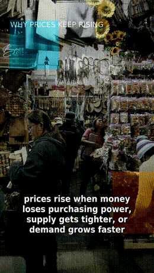
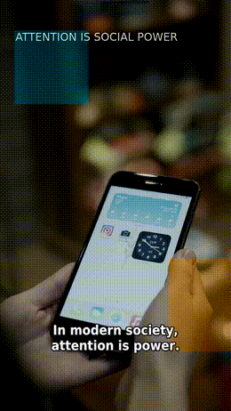

<div align="center">
<h1 align="center">MoneyCreatorFree 🎬</h1>

<p align="center">
  
  
  
</p>
<br>

Free, local-first short-video creation engine for AI agents and creators.

Just provide an idea or YAML config, and **MoneyCreatorFree** will automatically generate a vertical short video using **MOSS-TTS**, **Whisper** subtitles, free **Pexels** stock footage, **FFmpeg** rendering, and strict Quality Assurance (QA).
<br>


</div>

## 🎯 Features

- [x] **Local Voice Generation:** Uses MOSS-TTS (Adam voice by default, natural pitch).
- [x] **Auto-Synced Subtitles:** Powered by Whisper with a clean, minimal style (DejaVu Sans Condensed).
- [x] **Smart Stock Footage:** Auto-matches free Pexels stock video to scene keywords and stitches clips to fit narration length.
- [x] **High-Quality Rendering:** FFmpeg 9:16 vertical video renderer with lightweight motion overlays.
- [x] **Strict QA Checks:** Automated quality assurance for duration, sync, transcript coverage, and output size.
- [x] **Agent-Ready:** Native compatibility and instructions for Hermes, OpenClaw, Claude Code, and Codex-style agents.
- [x] **End-to-End CLI:** Includes `setup-moss`, `doctor`, and an interactive `init` wizard for topic, duration, voice, subtitle font, and stock keywords.

## 🎬 Example Demos

Here are sample vertical videos (9:16) generated completely automatically. The GIF previews render directly on GitHub, and each preview links to the uploaded MP4 demo.

<table>
<thead>
<tr>
<th align="center">📈 Why prices keep rising</th>
<th align="center">📱 Attention is social power</th>
<th align="center">💰 The first rule of personal finance</th>
</tr>
</thead>
<tbody>
<tr>
<td align="center">
<a href="https://raw.githubusercontent.com/Adamchaua/MoneyCreatorFree/main/assets/demos/economy.mp4">

</a>
</td>
<td align="center">
<a href="https://raw.githubusercontent.com/Adamchaua/MoneyCreatorFree/main/assets/demos/society.mp4">

</a>
</td>
<td align="center">
<a href="https://raw.githubusercontent.com/Adamchaua/MoneyCreatorFree/main/assets/demos/finance.mp4">

</a>
</td>
</tr>
<tr>
<td align="center"><a href="https://raw.githubusercontent.com/Adamchaua/MoneyCreatorFree/main/assets/demos/economy.mp4">▶ Watch MP4</a></td>
<td align="center"><a href="https://raw.githubusercontent.com/Adamchaua/MoneyCreatorFree/main/assets/demos/society.mp4">▶ Watch MP4</a></td>
<td align="center"><a href="https://raw.githubusercontent.com/Adamchaua/MoneyCreatorFree/main/assets/demos/finance.mp4">▶ Watch MP4</a></td>
</tr>
</tbody>
</table>

> GitHub does not always render HTML `<video>` tags in README files, so this README uses real inline GIF previews plus direct MP4 links for reliable playback.

## ⚡ Quickstart

```bash
git clone https://github.com/Adamchaua/MoneyCreatorFree.git
cd MoneyCreatorFree
python3 -m venv .venv
. .venv/bin/activate
pip install -U pip
pip install -e .
cp .env.example .env
```

Edit `.env` to add your credentials and paths:

```text
PEXELS_API_KEY=your_pexels_api_key_here
MOSS_DIR=/absolute/path/to/MOSS-TTS-Nano-main
```

Install MOSS-TTS-Nano into this repo's ignored `third_party/` folder:

```bash
python -m moneycreator.cli setup-moss
```

Check the full environment before rendering:

```bash
python -m moneycreator.cli doctor
```

### Interactive Wizard

Create a video config by answering guided questions for topic, length, voice, subtitle font, Whisper model, and stock keywords:

```bash
python -m moneycreator.cli init
```

Create the config and render immediately:

```bash
python -m moneycreator.cli init --render
```

### Run Examples

Run a single video config:

```bash
python -m moneycreator.cli create --config examples/economy_15s.yaml
```

Run all example configs in batch mode:

```bash
python -m moneycreator.cli batch --configs examples
```

Detailed setup and workflow docs:

```text
docs/moss-tts-setup.md
docs/workflow.md
```

## 🖥️ Hardware Requirements

GPU is optional. MoneyCreatorFree can run fully on CPU because MOSS-TTS-Nano is lightweight and FFmpeg rendering is CPU-friendly.

| Component | Minimum | Recommended | Notes |
| --- | --- | --- | --- |
| CPU | 4 cores | 6-8 cores | More cores speed up FFmpeg and TTS. |
| RAM | 4 GB | 8-16 GB | Whisper and MOSS dependencies need memory headroom. |
| GPU | Not required | Optional NVIDIA GPU | Useful for faster Whisper/model workloads, but not required. |
| Disk | 8 GB free | 20 GB+ free | MOSS dependencies, stock cache, and video outputs grow over time. |
| OS | Linux/macOS/Windows | Linux or Windows 10+ | FFmpeg and Python 3.10+ required. |

## 🧰 One-Command Install

Linux/macOS:

```bash
bash scripts/setup_all.sh
```

Windows PowerShell:

```powershell
powershell -ExecutionPolicy Bypass -File scripts/setup_all.ps1
```

Manual install is still supported through the Quickstart commands above.

## 📂 Output Structure

Once generation is complete, the outputs are neatly organized:

```text
outputs/<run_id>/
├── config.yaml          # Original configuration
├── script.txt           # Generated/Provided script
├── voice.wav            # Generated TTS audio
├── subtitle.ass         # Auto-synced ASS subtitles
├── stock_manifest.json  # Pexels stock videos downloaded
├── final.mp4            # The final rendered video
└── qa.json              # Quality Assurance report
```

## ✅ Quality Assurance (QA)

Every video goes through an automated QA pipeline. `final.mp4` is only approved if:
- Target duration is within tolerance.
- Audio and video are perfectly synced (under 0.3s variance).
- Subtitle file contains at least 3 segments.
- Transcript coverage is > 70%.
- At least 3 stock clips were successfully integrated.
- Output file size is > 300KB.

## 🤖 Agent Compatibility

This repo is built to be driven by AI agents. It includes:

| Agent | Guide |
| --- | --- |
| Hermes | `HERMES.md` |
| Codex-style agents | `AGENTS.md` |
| Claude Code | `CLAUDE.md` |
| OpenClaw | `OPENCLAW.md` |

*Agents should read their guide plus `docs/workflow.md` before modifying code or running the pipeline.*

## 🗺️ Roadmap

- [ ] Pixabay provider integration
- [ ] JSON/YAML batch templates
- [ ] Word-by-word dynamic subtitles
- [ ] Music bed with audio ducking
- [ ] Advanced stock video quality scoring
- [ ] Multi-variant rendering & auto-select best

## ❤️ Support & Donate

If **MoneyCreatorFree** helps you automate your workflows or generate revenue, consider supporting the project:

- **PayPal:** `ckelvinkhanh32@gmail.com`
- **GitHub Sponsors:** [Sponsor Adamchaua](https://github.com/sponsors/Adamchaua)
- **EVM Wallet (ETH/BNB/Polygon):** `0x1ecab01075f3bdf1b56b7D849c8e28ef88943624`

## 🔒 Security Note
**Do not commit `.env` or real API keys.** Use `.env.example` as the template.