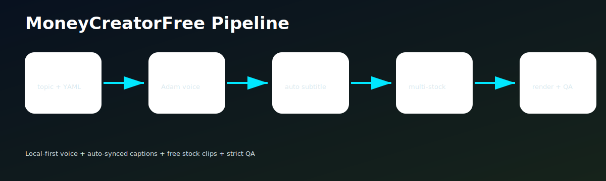

<div align="center">
<h1 align="center">MoneyCreatorFree 🎬</h1>

<p align="center">
  
  
  
</p>
<br>

Free, local-first short-video creation engine for AI agents and creators.

Just provide an idea or YAML config, and **MoneyCreatorFree** will automatically generate a vertical short video using **MOSS-TTS**, **Whisper** subtitles, free **Pexels** stock footage, **FFmpeg** rendering, and strict Quality Assurance (QA).
<br>



</div>

## 🎯 Features

- [x] **Local Voice Generation:** Uses MOSS-TTS (Adam voice by default, natural pitch).
- [x] **Auto-Synced Subtitles:** Powered by Whisper with a clean, minimal style (DejaVu Sans Condensed).
- [x] **Smart Stock Footage:** Auto-matches free Pexels stock video to scene keywords and stitches clips to fit narration length.
- [x] **High-Quality Rendering:** FFmpeg 9:16 vertical video renderer with lightweight motion overlays.
- [x] **Strict QA Checks:** Automated quality assurance for duration, sync, transcript coverage, and output size.
- [x] **Agent-Ready:** Native compatibility and instructions for Hermes, OpenClaw, Claude Code, and Codex-style agents.

## 🎬 Example Demos

Here are some sample vertical videos (9:16) generated completely automatically:

<table>
<thead>
<tr>
<th align="center">📈 Why prices keep rising</th>
<th align="center">📱 Attention is social power</th>
<th align="center">💰 The first rule of personal finance</th>
</tr>
</thead>
<tbody>
<tr>
<td align="center"><video src="https://github.com/Adamchaua/MoneyCreatorFree/raw/main/assets/demos/economy.mp4"></video></td>
<td align="center"><video src="https://github.com/Adamchaua/MoneyCreatorFree/raw/main/assets/demos/society.mp4"></video></td>
<td align="center"><video src="https://github.com/Adamchaua/MoneyCreatorFree/raw/main/assets/demos/finance.mp4"></video></td>
</tr>
</tbody>
</table>

> *Note: Click to play the video. If the video does not play inline, you can view the source files directly in the `assets/demos/` folder.*

## ⚡ Quickstart

```bash
git clone https://github.com/Adamchaua/MoneyCreatorFree.git
cd MoneyCreatorFree
cp .env.example .env
```

Edit `.env` to add your credentials and paths:
```text
PEXELS_API_KEY=your_pexels_api_key_here
MOSS_DIR=/path/to/MOSS-TTS-Nano-main
```

### Run Examples

Run a single video config:
```bash
python -m moneycreator.cli create --config examples/economy_15s.yaml
```

Run all example configs in batch mode:
```bash
python -m moneycreator.cli batch --configs examples
```

## 📂 Output Structure

Once generation is complete, the outputs are neatly organized:

```text
outputs/<run_id>/
├── config.yaml          # Original configuration
├── script.txt           # Generated/Provided script
├── voice.wav            # Generated TTS audio
├── subtitle.ass         # Auto-synced ASS subtitles
├── stock_manifest.json  # Pexels stock videos downloaded
├── final.mp4            # The final rendered video
└── qa.json              # Quality Assurance report
```

## ✅ Quality Assurance (QA)

Every video goes through an automated QA pipeline. `final.mp4` is only approved if:
- Target duration is within tolerance.
- Audio and video are perfectly synced (under 0.3s variance).
- Subtitle file contains at least 3 segments.
- Transcript coverage is > 70%.
- At least 3 stock clips were successfully integrated.
- Output file size is > 300KB.

## 🤖 Agent Compatibility

This repo is built to be driven by AI. It includes:
- `AGENTS.md`: Guidelines for Hermes/Codex-style agents.
- `CLAUDE.md`: System instructions for Claude Code.
- `OPENCLAW.md`: Guidelines for OpenClaw.

*Agents should read these files before modifying code or running the pipeline.*

## 🗺️ Roadmap

- [ ] Pixabay provider integration
- [ ] JSON/YAML batch templates
- [ ] Word-by-word dynamic subtitles
- [ ] Music bed with audio ducking
- [ ] Advanced stock video quality scoring
- [ ] Multi-variant rendering & auto-select best

## ❤️ Support & Donate

If **MoneyCreatorFree** helps you automate your workflows or generate revenue, consider supporting the project:

- **PayPal:** `ckelvinkhanh32@gmail.com`
- **GitHub Sponsors:** [Sponsor Adamchaua](https://github.com/sponsors/Adamchaua)
- **EVM Wallet (ETH/BNB/Polygon):** `0x1ecab01075f3bdf1b56b7D849c8e28ef88943624`

## 🔒 Security Note
**Do not commit `.env` or real API keys.** Use `.env.example` as the template.